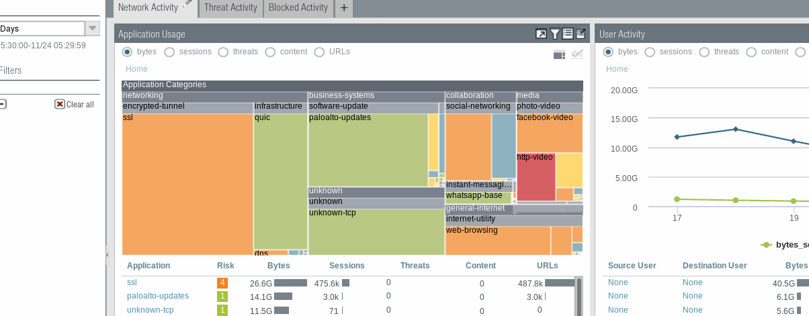

# SecOps

Agile and DevOps principles to improve CyberSecurity Operations.

This https://github.com/infchg/SecOps   includes new contributions on DevSecOps and Unmanned and CISA worksin addition to moved former https://github.com/infchg/palo-alto-watch as below:


# Palo Alto Watch

 
**Palo Alto Watch** has a series of infos and scripts to help FireWall forensics investigations in [Splunk] or Elastic.
These infos bring new details to  the [standard] Palo Alto tools and charts.

## Why 

During forensics, we need to investigate specific times of deviations counted by the Firewalls.
We might have Palo Alto parameters, charts, logs, and tools but would be ideal to research in our own elastic or splunk.

This has also a place to add and discuss latest SecOps improvements https://github.com/infchg/palo-alto-watch/discussions/1

## How

Since old PAN-OS v7 few firewall counters could be accessed through Palo Alto Networks private MIBs.
A handful of those SNMP OIDs are very valuable, but only succinctly documented in Palo Alto MIBs.

The simple script below let you track live key Firewall counters. 
```bash
((date +%s.%2N && snmpbulkget -mALL  -Os -c $PAS  -v 2c -Cr1 -Oqvt  $FW \
enterprises.25461.2.1.2.1.19.8.10 enterprises.25461.2.1.2.1.19.8.14 \ 
enterprises.25461.2.1.2.1.19.8.18 enterprises.25461.2.1.2.1.19.8.30  \
enterprises.25461.2.1.2.1.19.8.31 enterprises.25461.2.1.2.1.19.11.7 \
1.3.6.1.4.1.25461.2.1.2.3.4  SysUptime && date +%s.%2N  ) | perl -pe 'chop; s/$/ /g' && echo ) >> $bas/pa-$FW.txt
#tim sessdeny icmp udp synmaxthre activred nonsynunmatch activeTCP  upti time
```
This demo saves the parameters to a data file. The structure is:  

     timestamp sessdeny icmp udp synmaxthre activred nonsynunmatch activeTCP  FWuptime timestamp
     
(the timestamp an uptimes a couple of symmetry-checks for site reliability)

## Needs

You can run the script on a small linux shell, in any box able to reach the FW management interface.  
(between the points 1 and 2 of this architecture in Fig.0).

Fig0 

Verified in bash CentOS  it should run well in Ubuntu, RHEL, Debian, even windows' GITshell ...

## Examples

Calling the script in crontabs or loops let us pull Firewall data every few  seconds, this let you find the precise time of issues or attacks.

We identified 10 Palo Alto Counters (Figure 1 rainbow colors) useful for investigating attacks. Some counters are in the Palo Alto CLI too, but SNMP let us monitor FW every few secs and keep the 10 key values in logs .. Matlab etc :
 
Fig1. 

The number of TCP drops due to non-syn/non-session is especially important. This splunk example filters the snmp-gathered data for just a pair of HA Firewalls. The plot let us identify peaks visually, at those moments our infrastructure or providers suffered short glitches ( + delays in  eBGP).  
.  
Fig2.  
Usually the Palo Alto NonSYN NonSession drops is a small percentage ~2% of regular traffic, and it follows the typical daily usage curve. These regular nonSYN are due to glitches randomly distributed among users, caused by individual user browsers, their devices, or local user isp disconnections. 

 
## Scalable
 
The FW monitoring scales up well using simple bash scripts collect among many FWs and feed logs to Elastic or Splunk for plots. We could follow 10 firewalls around America, Asia, Europe. Usually tracked those per minute (20sec in high business). These examples had millions hits to many brands and apps, hence the high counter variance. The method to track PA can also help normal traffic of few webs.
```bash
fws=( 10.41.17.5 10.41.17.6  10.12.61.5   10.12.61.6  10.4.61.5 10.4.61.6 10.6.61.5  10.6.61.6 pwallx-1.domain  pwallx-2.domain   )
#remote pull by FW cluster just need to loop $FW among the values in the $fws list
for FW in $fws;
```
## Attacks
Let us see an attack example in Fig3. These are peaks that are not jumping by 6000 connections in a minute but rather jump abruptly over 20000 non-syn tcps is short time. Figure 3, of close monitoring of Palo Alto counters. The same figure let us detect precisely other moments of short disruptions (smaller peaks) due to own or near-own infrastructures (for instance caused by eBGP renegotiation after another link failed).
 
Fig3. 

Fig4.  

These monitored FW peaks were well contrasted against the providers’ reports on DOS attacks, as a confirmation.
   
In short. These SNMP counters and monitoring scripts complement well existing Palo Alto tools and summaries, because can add useful details to explore later in elastic, splunk, etc. It track attacks and issues and large consumer peaks real time with better precision than own PA tools.
  

Fig5.  


This monitoring works independently to minimize risks , a server nearby pulls 10 snmp values via the PA management interface.


### others details

zooming out the time and values during the peaks & attacks
 

 
## Tests
This work was developed 2015-19 tracking large Palo Alto firewalls closely, it can feed logs to elastic, splunk, …. 
This lead us evolve from large operations into Site Reliability Engineering (service oriented, automated, scaled)

### Notes

 

splunk
: 

standard
: [standard PA image](doc/pa-standard.png)


[splunk]: #notes "image below"

[standard]: #notes "image below"  

 


### PA standards

Since PAN-OS v7.0.0, the following counters could also be accessed through Palo Alto Networks private MIBs:
 
- panGlobalCountersDOSCounters
- panGlobalCountersDropCounters
- panGlobalCountersIPFragmentationCounters
- panGlobalCountersTCPState
 
while  CLI command to extract Flow counters with a DoS aspect:
> show counter global filter category flow aspect dos


- [x] service level oriented
- [x] automated
- [x] scalable

### OLDER <2015

#### Beluga Information-Change coding language  
 
Previous graphical flows were coded in beluga graphical language. 
We gave few examples querying Google App Enginge infchg site in beluga. 

Later the application was renamed in the Google Compute preview App. 
The google cloud URLs  are no longer reacheable, Since the Beluga service was moved to other cloud servers, 

  - backlog:  the urls to be updated with the correct servers apps on GC & AWS


<i class="bi bi-meter">ll</i>
<i class="bi-binoculars-fill">cx</i<

#### META 
<link href="https://maxcdn.bootstrapcdn.com/bootstrap/3.3.7/css/bootstrap.min.css" rel="stylesheet" type="text/css" />
<script src="https://maxcdn.bootstrapcdn.com/bootstrap/3.3.7/js/bootstrap.min.js"></script>


<script src="//maxcdn.bootstrapcdn.com/bootstrap/3.3.6/js/bootstrap.min.js"></script>
<link rel="stylesheet" href="//maxcdn.bootstrapcdn.com/bootstrap/3.3.6/css/bootstrap.min.css">

