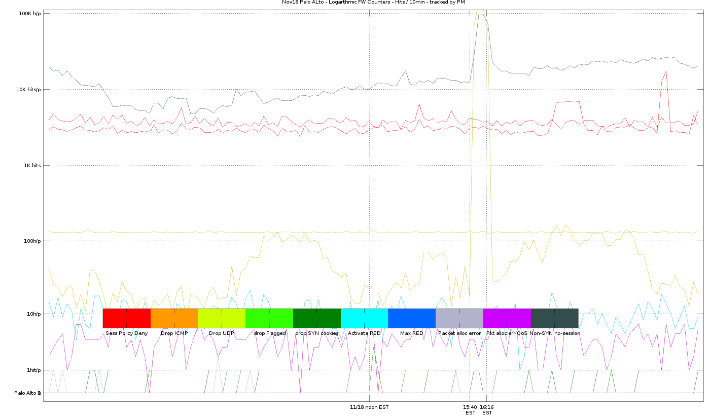
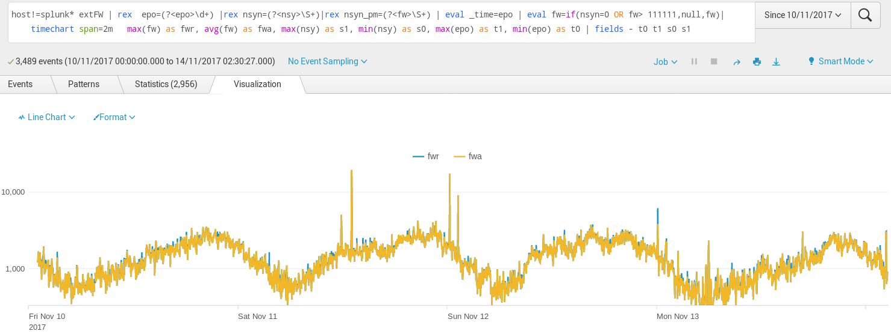
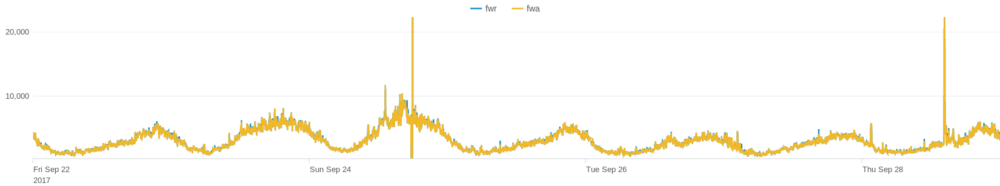
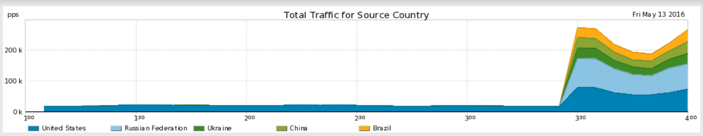
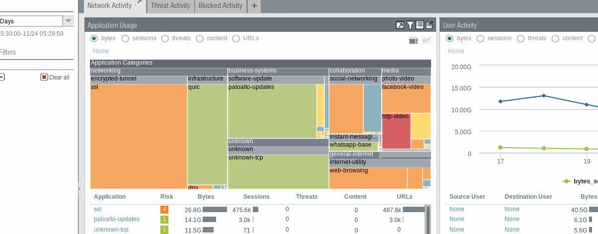
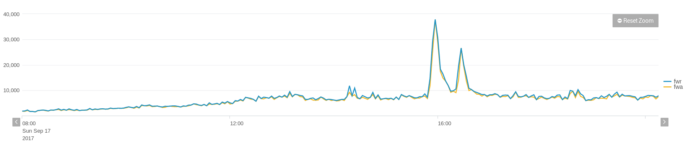

This work was developed 2015-18 and tracks Palo Alto firewalls closely, it can feed logs to elastic, splunk, …. 

It let us track FW every few seconds, it is rarely documented by the manufacturer (apart succinct SNMP MIB files)  

```bash
((date +%s.%2N && snmpbulkget -mALL  -Os -c $PAS  -v 2c -Cr1 -Oqvt  $FW  enterprises.25461.2.1.2.1.19.8.10 enterprises.25461.2.1.2.1.19.8.14 enterprises.25461.2.1.2.1.19.8.18 enterprises.25461.2.1.2.1.19.8.30   enterprises.25461.2.1.2.1.19.8.31 enterprises.25461.2.1.2.1.19.11.7 1.3.6.1.4.1.25461.2.1.2.3.4  SysUptime && date +%s.%2N  ) | perl -pe 'chop; s/$/ /g' && echo ) >> $bas/pa-$FW.txt #tim sessdeny icmp udp synmaxthre activred nonsynunmatch activeTCP  upti time
```

I identified 10 Palo Alto Counters (Figure 1 rainbow colors) useful for investigating attacks. Some counters are in the Palo Alto CLI too, but SNMP let us monitor FW every few secs and keep the 10 key values in logs .. Matlab etc :
 
Fig1. 

The number of TCP drops due to non-syn/non-session is especially important. This splunk example filters the snmp-gathered data for just a pair of HA Firewalls. The plot let us identify peaks visually, at those moments our infrastructure or providers suffered short glitches ( + delays in  eBGP).  
.  
Fig2.  
Usually the Palo Alto NonSYN NonSession drops is a small percentage ~2% of regular traffic, and it follows the typical daily usage curve. These regular nonSYN are due to glitches randomly distributed among users, caused by individual user browsers, their devices, or local user isp disconnections. 

The FW monitoring scales up well using simple bash scripts. That way I could follow 10 firewalls around America, Asia, Europe. Usually tracked those per minute (20sec in high business). These examples had millions hits to many brands and apps, hence the high counter variance. The method to track PA can also help normal traffic of few webs.
```bash
fws=( 10.41.17.5 10.41.17.6  10.12.61.5   10.12.61.6  10.4.61.5 10.4.61.6 10.6.61.5  10.6.61.6 pwallx-1.domain  pwallx-2.domain   )  #remote pull by FW cluster
```

You can identify Attacks too: peaks that are not jumping by 6000 connections in a minute bur rather jump abruptly over 20000 non-syn tcps is short time. Figure 3, of close monitoring of Palo Alto counters. The same figure let us identify precisely other moments of short disruptions (smaller peaks) due to own or near-own infrastructures (for instance caused by eBGP renegotiation after one of the links failed).
 
Fig3. 

Fig4.  

These monitored FW peaks were well contrasted against the providers’ reports on DOS attacks, as a confirmation.
   
In short. These SNMP counters and monitoring scripts complement well existing Palo Alto tools and summaries, because can add useful details to explore later in elastic, splunk, etc. It track attacks and issues and large consumer peaks real time with better precision than own PA tools.
  

Fig5.  


This monitoring works independently to minimize risks , a server nearby pulls 10 snmp values via the PA management interface.


### others details

zooming out the time and values during the peaks & attacks
 

 
